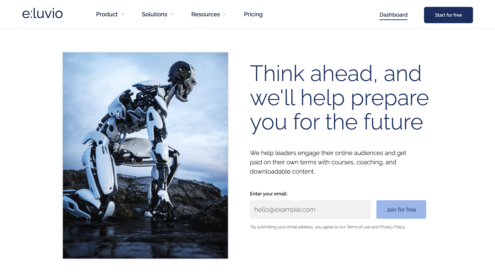

# eluvio

<table>
<tr>
<td align="center">
  This is a project that I am currently designing and developing, with an enterprise SAAS company in mind. I plan to make this a full stack application, with a fully customizable dashboard, using the React JS Library.
</td>
</tr>
</table>

## Demo

Here is a live demo : https://eluvio.netlify.app/

## Technologies

- HTML
- CSS
- JavaScript
- React

## Features

- Context API for state management.
- Recharts UI component library.
- Customizable Dashboard with user login authentication.
- React Router V6 for page navigation.
- Custom REST api with the use of JSON server.
- Responsive Design.
